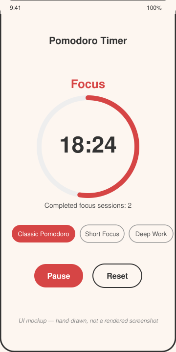

# Pomodoro Timer

A single-screen Android Pomodoro timer: pick a preset, run alternating focus/break countdowns, and track completed sessions.



*UI mockup — hand-drawn, not a screenshot. This sandbox has no Android emulator, so the app was built and packaged but never launched on a device.*

## How to run

Requires a JDK 17+ and the Android SDK (`ANDROID_HOME` set, platform 35 and build-tools installed).

```bash
cd projects/2026-09-09-android-pomodoro-timer
./gradlew assembleDebug
```

The debug APK is written to `app/build/outputs/apk/debug/app-debug.apk`. Install it on a device or emulator with:

```bash
adb install app/build/outputs/apk/debug/app-debug.apk
```

## Stack

- Kotlin, Jetpack Compose, Material 3
- `ViewModel` + `StateFlow` for timer state
- Gradle Kotlin DSL, Gradle wrapper included (8.9)
- Presets read from `mock/presets.json` (bundled as an Android asset) through a `PresetRepository` interface — swap `LocalPresetRepository` for a networked implementation later without touching the ViewModel or UI

## Limitations

- No emulator or physical device was available in this environment, so the app was never actually launched or tapped through. What *was* verified: `./gradlew assembleDebug` runs clean on this repo's Android SDK (compile, resource merge, dex, package all succeed) and the packaged APK contains `assets/mock/presets.json`.
- `preview.svg` is a hand-drawn mockup of the intended layout, not a real screenshot.
- No persistence: closing the app resets the timer and session count.
