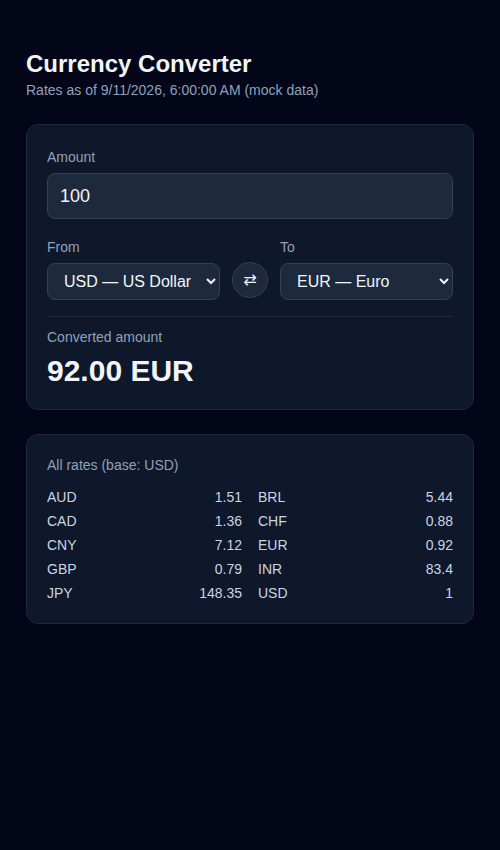

# Currency Converter

A single-screen React app that converts an amount between currencies using fixture exchange rates, with a full rate table shown below.



*Real screenshot, captured headlessly with Chromium against a running `vite preview` server.*

## How to run

Requires Node.js 20+.

```bash
cd projects/2026-09-11-web-currency-converter
npm install
npm run dev
```

Open the printed local URL (default `http://localhost:5173`). To build and serve the production bundle instead:

```bash
npm run build
npm run preview
```

## Stack

- React 19 + TypeScript, scaffolded with Vite 8
- Tailwind CSS v4 via `@tailwindcss/vite`
- Rates are fetched with `MockRatesProvider` (`src/lib/ratesProvider.ts`), which implements a `RatesProvider` interface and reads `public/mock/rates.json` (a served copy of `mock/rates.json`) over `fetch`. A real API-backed provider could replace it later by editing only that one file.
- `oxlint` for linting (`npm run lint`)

## Limitations

- Exchange rates are static fixture data (`mock/rates.json`), not live — there is no API key or network call to a real provider.
- No historical rates, favorites, or persistence: reloading the page resets the amount and currency selection to their defaults.
- Only the ten currencies listed in the fixture are available.
