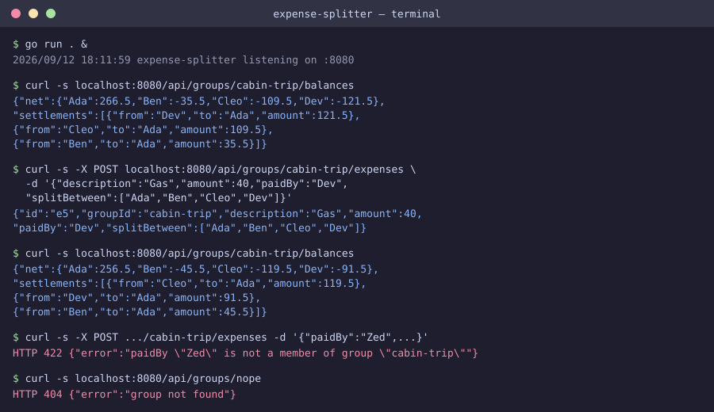

# Expense Splitter

A small Go backend that tracks shared group expenses and tells you the minimal set of payments needed to settle up.



The image above is a labelled recreation of the real terminal output captured while verifying this project (see "How to run" for the exact commands used).

## How to run

Requires only the Go toolchain (developed and tested with Go 1.24).

```sh
cd projects/2026-09-12-backend-expense-splitter
go build ./...
go run . &
```

Then, from another shell:

```sh
curl -s http://localhost:8080/api/groups
curl -s http://localhost:8080/api/groups/cabin-trip
curl -s http://localhost:8080/api/groups/cabin-trip/expenses
curl -s http://localhost:8080/api/groups/cabin-trip/balances

curl -s -X POST http://localhost:8080/api/groups/cabin-trip/expenses \
  -H 'Content-Type: application/json' \
  -d '{"description":"Gas","amount":40,"paidBy":"Dev","splitBetween":["Ada","Ben","Cleo","Dev"]}'
```

Set `PORT=<n>` before `go run .` to listen on a different port.

## API

| Method | Path | Description |
|---|---|---|
| GET | `/api/groups` | List all groups |
| GET | `/api/groups/{id}` | Get one group |
| GET | `/api/groups/{id}/expenses` | List a group's expenses |
| POST | `/api/groups/{id}/expenses` | Add an expense (`description`, `amount`, `paidBy`, `splitBetween[]`) |
| GET | `/api/groups/{id}/balances` | Net balance per member, plus a minimal list of settlements |

Expenses are split evenly across `splitBetween`. Balances are settled with a greedy
largest-debtor/largest-creditor match, which produces the fewest payments needed to
zero everyone out.

## Stack

- Go 1.24, standard library only (`net/http`, `encoding/json`) — no external dependencies
- In-memory store seeded from `mock/groups.json` and `mock/expenses.json` behind a
  `Store` interface (`store.go`); a real database-backed store would implement the
  same interface and swap in without touching `handlers.go`

## Limitations

- Data added via `POST` lives only in memory for the life of the process; it is not
  written back to the fixture files and resets on restart.
- Splits are always even across `splitBetween`; there's no support for unequal shares
  or percentages.
- No authentication — this is a mock backend for a single evening's scope, not a
  deployable multi-tenant service.
