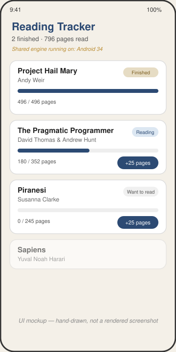

# Reading Tracker

A Kotlin Multiplatform reading tracker: the book list, progress math, and state management live in a `shared` module, with a Jetpack Compose screen on Android that lists books, shows read-progress bars, and lets you log pages.



*UI mockup — hand-drawn, not a screenshot. This sandbox has no Android emulator, so the app was built and packaged but never launched on a device.*

## How to run

Requires a JDK 17+ and the Android SDK (`ANDROID_HOME` set, platform 35 and build-tools installed).

```bash
cd projects/2026-09-13-kmp-reading-tracker
./gradlew :shared:assemble          # builds the shared module's Android target (klib/jar); iOS targets are skipped on Linux
./gradlew :shared:testDebugUnitTest # runs the shared unit tests
./gradlew :androidApp:assembleDebug # builds the runnable Android app
```

The debug APK is written to `androidApp/build/outputs/apk/debug/androidApp-debug.apk`. Install it on a device or emulator with:

```bash
adb install androidApp/build/outputs/apk/debug/androidApp-debug.apk
```

## Stack

- Kotlin Multiplatform: `shared/` module with `commonMain` (models, `BookRepository`/`BookJsonSource` interfaces, `MockBookRepository`, `ReadingListModel` state holder), `androidMain`, and `iosMain`
- `expect fun currentPlatformLabel()` / `actual` per platform — the shared UI footer shows whichever platform it's running on
- `AndroidBookJsonSource` (androidMain) and `IosBookJsonSource` (iosMain) each read the same `mock/books.json` fixture differently — swap either for a networked `BookJsonSource` without touching `MockBookRepository` or the UI
- kotlinx.serialization for JSON decoding, kotlinx.coroutines `StateFlow` for shared state
- Android app: Jetpack Compose, Material 3, Gradle Kotlin DSL, Gradle wrapper included (8.9)
- Unit tests (`shared/src/commonTest`) cover `Book` progress/status transitions and `MockBookRepository` parsing, run on the JVM via `:shared:testDebugUnitTest`

## Limitations

- **Verified only on the Android target.** `./gradlew :shared:assemble`, `:shared:testDebugUnitTest` (5 tests, all green), and `:androidApp:assembleDebug` all pass on this runner, and the resulting APK was inspected to confirm it contains the shared module's classes and the bundled `assets/mock/books.json`. No emulator or device was available, so the app was never actually launched or tapped through.
- **iOS target is source-only.** `iosX64`, `iosArm64`, and `iosSimulatorArm64` are declared in `shared/build.gradle.kts`; the Kotlin/Native compiler disables them on this Linux host ("cannot be built on this machine") and `shared/src/iosMain` (`Platform.ios.kt`, `IosBookJsonSource.kt`) has never been compiled. The code is clean and complete, but unverified — building it for real requires Xcode on macOS.
- No persistence: page progress logged in the app resets when the process dies, since it only lives in the in-memory `ReadingListModel` state.
- No way to add or remove books — the list is fixed to what's in `mock/books.json`.
