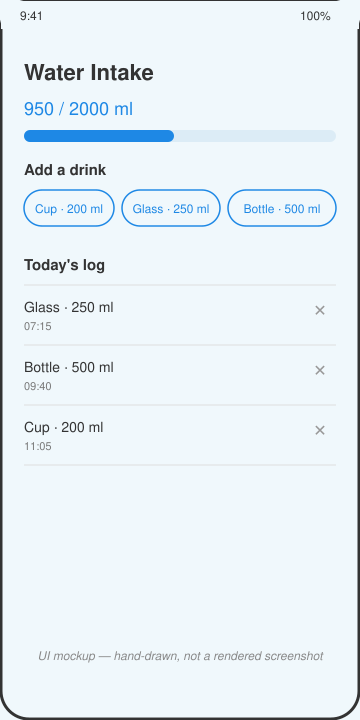

# Water Intake Log

A single-screen Android app that logs drinks against a daily water goal and shows progress with a running total.



*UI mockup — hand-drawn, not a screenshot. This sandbox has no Android emulator, so the app was built and packaged but never launched on a device.*

## How to run

Requires a JDK 17+ and the Android SDK (`ANDROID_HOME` set, platform 35 and build-tools installed).

```bash
cd projects/2026-09-14-android-water-intake-log
./gradlew assembleDebug
```

The debug APK is written to `app/build/outputs/apk/debug/app-debug.apk`. Install it on a device or emulator with:

```bash
adb install app/build/outputs/apk/debug/app-debug.apk
```

## Stack

- Kotlin, Jetpack Compose, Material 3
- `ViewModel` + `StateFlow` for log state
- Gradle Kotlin DSL, Gradle wrapper included (8.9)
- Daily goal, drink presets, and today's starting entries read from `mock/water_log.json` (bundled as an Android asset) through a `WaterLogRepository` interface — swap `LocalWaterLogRepository` for a networked implementation later without touching the ViewModel or UI

## Limitations

- No emulator or physical device was available in this environment, so the app was never actually launched or tapped through. What *was* verified: `./gradlew assembleDebug` runs clean on this repo's Android SDK (compile, resource merge, dex, package all succeed) and the packaged APK contains `assets/mock/water_log.json`.
- `preview.svg` is a hand-drawn mockup of the intended layout, not a real screenshot.
- No persistence: closing the app resets the log to the fixture's starting entries. New entries added during a session get a fresh ID and the current device time, but nothing is written back to disk.
