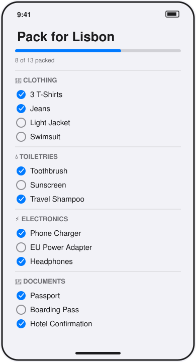

# Packing List

A single-screen SwiftUI app that groups a trip's packing items by category (Clothing, Toiletries, Electronics, Documents) and lets you check each one off, with a progress bar showing how much is packed.



*Hand-drawn UI mockup, not a screenshot — see Limitations.*

## How to run

Requires Swift 6+ (works on Linux for the non-UI pieces; the app itself needs Xcode on macOS).

```bash
cd projects/2026-09-15-ios-packing-list
swift build   # fails on `import SwiftUI` outside macOS/Xcode — expected, see below
swift test
```

To actually see the screen, open the package in Xcode, add a new iOS App target, set `PackingListApp` (from the `PackingList` library) as its `@main` entry point, and run it in the simulator.

## Stack

- Swift 6, SwiftUI, `@Observable` for the view model (`PackingListModel`)
- Swift Package Manager, no external dependencies
- Items read from `mock/packing.json` (bundled as a Swift package resource) through a `PackingRepository` protocol — `MockPackingRepository` is the only implementation today; a networked one can replace it later without touching the view model or views
- Unit tests (`Tests/PackingListTests`) cover the toggle logic and JSON decoding on `PackingItem`, using the `Testing` framework

## Limitations

- **Written but not run.** This runner is Linux with no Xcode, no iOS Simulator, and no `SwiftUI` module (`swift build` fails with `error: no such module 'SwiftUI'` on the app entry point, which is expected here — that's the whole reason there's no screenshot). The source is complete and should build and run as-is in Xcode. `preview.svg` is a hand-drawn UI mockup, not a screenshot.
- No persistence: toggling an item only updates in-memory state — relaunching the app resets to the fixture data in `mock/packing.json`.
- No way to add, edit, or delete items, or to switch trips — the list is fixed to what's in the fixture.
