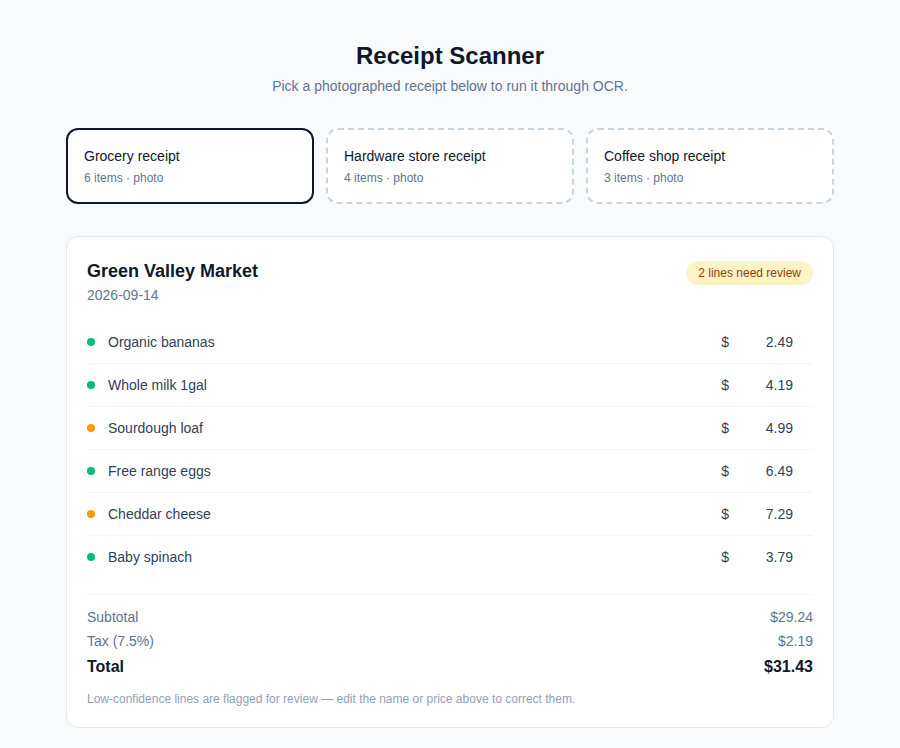

# Receipt Scanner

A single-screen Vue app that runs mock OCR on a picked receipt photo, itemizes it, flags low-confidence lines, and recalculates the total as you correct them.



*Real screenshot, captured headlessly with Chromium against a running `vite preview` server, after fixing a flagged low-confidence line.*

## How to run

Requires Node.js 20+.

```bash
cd projects/2026-09-16-web-receipt-scanner
npm install
npm run dev
```

Open the printed local URL (default `http://localhost:5173`). Click any of the three receipt cards to "scan" it, then edit a flagged line's name or price to see the subtotal, tax, and total recalculate. To build and serve the production bundle instead:

```bash
npm run build
npm run preview
```

## Stack

- Vue 3 + TypeScript, scaffolded with Vite 8, Composition API and `<script setup>` throughout
- Tailwind CSS v4 via `@tailwindcss/vite`
- Scans are fetched with `MockOcrProvider` (`src/lib/ocrProvider.ts`), which implements an `OcrProvider` interface and reads `public/mock/receipts.json` (a served copy of `mock/receipts.json`) over `fetch`, with a simulated delay standing in for OCR latency. A real vision-API-backed provider could replace it later by editing only that one file.

## Limitations

- OCR is entirely mocked: the three "photos" are just fixture data with pre-baked confidence scores, there is no image upload or real text recognition.
- Confidence scoring is static per fixture line, not derived from anything — it exists to demonstrate the review/correct workflow a real OCR integration would need.
- No persistence: edits to a scanned receipt are lost on reload or when switching to another receipt.
