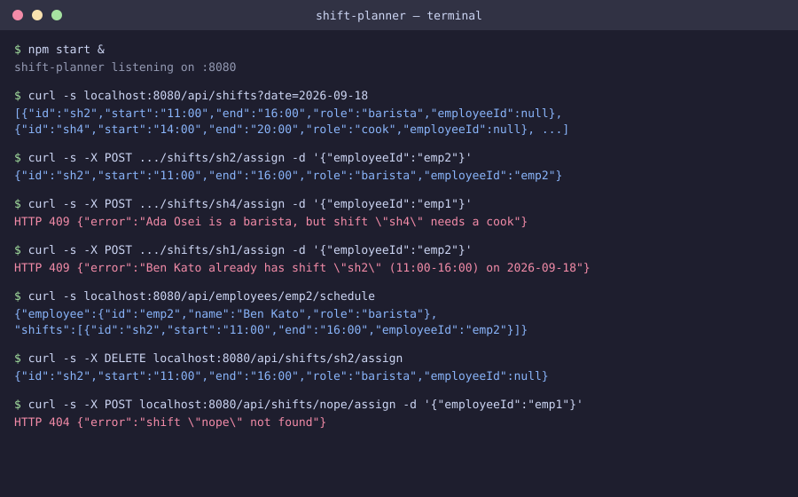

# Shift Planner

A small TypeScript backend that manages a workplace shift schedule: list open shifts, assign an employee, and get rejected with a clear reason when the role doesn't match or the employee is already booked at that time.



The image above is a labelled recreation of the real terminal output captured while verifying this project (see "How to run" for the exact commands used).

## How to run

Requires only Node.js (developed and tested with Node 22).

```sh
cd projects/2026-09-17-backend-shift-planner
npm install
npm run build   # type-checks the whole project
npm start &
```

Then, from another shell:

```sh
curl -s "localhost:8080/api/shifts?date=2026-09-18"

curl -s -X POST localhost:8080/api/shifts/sh2/assign \
  -H 'Content-Type: application/json' -d '{"employeeId":"emp2"}'

# rejected: emp1 is a barista, sh4 needs a cook
curl -s -X POST localhost:8080/api/shifts/sh4/assign \
  -H 'Content-Type: application/json' -d '{"employeeId":"emp1"}'

# rejected: emp2 already has an overlapping shift that day
curl -s -X POST localhost:8080/api/shifts/sh1/assign \
  -H 'Content-Type: application/json' -d '{"employeeId":"emp2"}'

curl -s localhost:8080/api/employees/emp2/schedule
curl -s -X DELETE localhost:8080/api/shifts/sh2/assign
```

## Endpoints

- `GET /api/employees` — list all employees
- `GET /api/employees/:id/schedule` — an employee and their assigned shifts
- `GET /api/shifts?date=YYYY-MM-DD` — list shifts, optionally filtered by date
- `POST /api/shifts/:id/assign` — assign `{ "employeeId": "..." }` to a shift; `409` on role mismatch or a time-overlapping shift for that employee, `404` if the shift or employee doesn't exist
- `DELETE /api/shifts/:id/assign` — clear a shift's assignment

## Stack

TypeScript, [Hono](https://hono.dev/) on `@hono/node-server`, run directly with `tsx`. No database: `src/store.ts` defines a `ShiftStore` interface, and `JsonShiftStore` loads its seed data from `mock/employees.json` and `mock/shifts.json` into memory on startup. Swapping in a real database later means writing one new class behind the same interface.

## Limitations

- All state is in-memory and resets on restart — there is no persistence layer.
- Mock data only, per the project rules: no real employees, no auth, no external calls.
- Overlap detection only checks same-day shifts for the same employee; it does not model breaks, overnight shifts crossing midnight, or max-hours rules.
