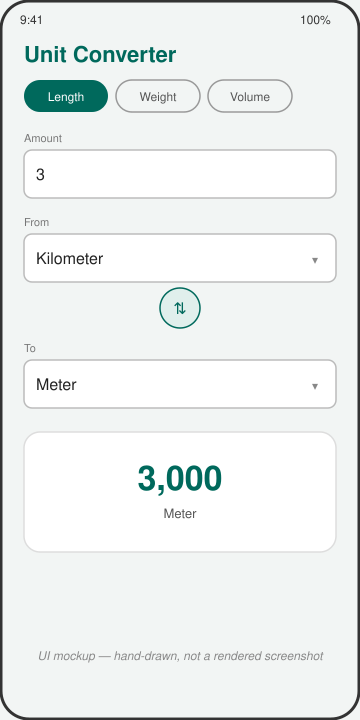

# Unit Converter

A Kotlin Multiplatform unit converter: category selection, unit lookup, and the conversion math live in a `shared` module, with a Jetpack Compose screen on Android that lets you pick a category, choose From/To units, and see the live result.



*UI mockup — hand-drawn, not a screenshot. This sandbox has no Android emulator, so the app was built and packaged but never launched on a device.*

## How to run

Requires a JDK 17+ and the Android SDK (`ANDROID_HOME` set, platform 35 and build-tools installed).

```bash
cd projects/2026-09-18-kmp-unit-converter
./gradlew :shared:assemble          # builds the shared module's Android target (klib/jar); iOS targets are skipped on Linux
./gradlew :shared:testDebugUnitTest # runs the shared unit tests
./gradlew :androidApp:assembleDebug # builds the runnable Android app
```

The debug APK is written to `androidApp/build/outputs/apk/debug/androidApp-debug.apk`. Install it on a device or emulator with:

```bash
adb install androidApp/build/outputs/apk/debug/androidApp-debug.apk
```

## Stack

- Kotlin Multiplatform: `shared/` module with `commonMain` (`UnitDefinition`/`UnitCategory` models, the pure `UnitConverter.convert` function, `UnitRepository`/`UnitJsonSource` interfaces, `MockUnitRepository`, `ConverterModel` state holder), `androidMain`, and `iosMain`
- `expect fun formatResult(value: Double): String` / `actual` per platform — Android formats with `java.text.DecimalFormat`, iOS with `NSNumberFormatter`, so each target renders the same converted number through its own locale-aware formatter
- `AndroidUnitJsonSource` (androidMain) and `IosUnitJsonSource` (iosMain) each read the same `mock/units.json` fixture differently — swap either for a networked `UnitJsonSource` without touching `MockUnitRepository` or the UI
- kotlinx.serialization for JSON decoding, kotlinx.coroutines `StateFlow` for shared state
- Android app: Jetpack Compose, Material 3 (`ExposedDropdownMenuBox` for unit pickers, `FilterChip` for category selection), Gradle Kotlin DSL, Gradle wrapper included (8.9)
- Unit tests (`shared/src/commonTest`) cover `UnitConverter.convert` math and `MockUnitRepository`/`ConverterModel` parsing and defaulting, run on the JVM via `:shared:testDebugUnitTest`

## Limitations

- **Verified only on the Android target.** `./gradlew :shared:assemble`, `:shared:testDebugUnitTest` (6 tests, all green), and `:androidApp:assembleDebug` all pass on this runner, and the resulting APK was inspected (via `dexdump`/`strings` on its dex files) to confirm it contains the shared module's classes and the bundled `assets/mock/units.json`. No emulator or device was available, so the app was never actually launched or tapped through.
- **iOS target is source-only.** `iosX64`, `iosArm64`, and `iosSimulatorArm64` are declared in `shared/build.gradle.kts`; the Kotlin/Native compiler disables them on this Linux host ("cannot be built on this machine") and `shared/src/iosMain` (`Platform.ios.kt`, `IosUnitJsonSource.kt`) has never been compiled. The code is clean and complete, but unverified — building it for real requires Xcode on macOS.
- Only three categories (length, weight, volume) and only linear factor-based units — no temperature, which needs an offset, not just a multiplier.
- No persistence: the chosen category, units, and amount reset when the process dies, since they only live in the in-memory `ConverterModel` state.
