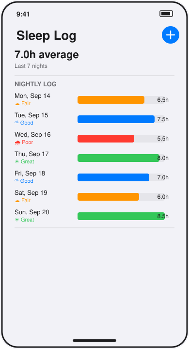

# Sleep Log

A single-screen SwiftUI app that shows the last week of sleep as a bar-per-night log with an average, and lets you log tonight's hours and quality.



*Hand-drawn UI mockup, not a screenshot — see Limitations.*

## How to run

Requires Swift 6+ (works on Linux for the non-UI pieces; the app itself needs Xcode on macOS).

```bash
cd projects/2026-09-20-ios-sleep-log
swift build   # fails on `import SwiftUI` outside macOS/Xcode — expected, see below
swift test
```

To actually see the screen, open the package in Xcode, add a new iOS App target, set `SleepLogApp` (from the `SleepLog` library) as its `@main` entry point, and run it in the simulator.

## Stack

- Swift 6, SwiftUI, `@Observable` for the view model (`SleepLogModel`)
- Swift Package Manager, no external dependencies
- Entries read from `mock/sleep.json` (bundled as a Swift package resource) through a `SleepRepository` protocol — `MockSleepRepository` is the only implementation today; a networked one can replace it later without touching the view model or views
- Unit tests (`Tests/SleepLogTests`) cover JSON decoding, the same-night replace rule in `addEntry`, the empty-log average, and date-string formatting, using the `Testing` framework

## Limitations

- **Written but not run.** This runner is Linux with no Xcode, no iOS Simulator, and no `SwiftUI` module (`swift build` fails with `error: no such module 'SwiftUI'` on the app entry point and every view file, which is expected here — that's the whole reason there's no screenshot). Everything outside those SwiftUI imports (models, repository, view model, tests) compiles cleanly on Linux. The source is complete and should build and run as-is in Xcode. `preview.svg` is a hand-drawn UI mockup, not a screenshot.
- No persistence: logging tonight's entry only updates in-memory state — relaunching the app resets to the fixture data in `mock/sleep.json`.
- Logging an entry for a date that's already in the log replaces that night rather than adding a duplicate; there's no way to edit or delete a past night directly.
