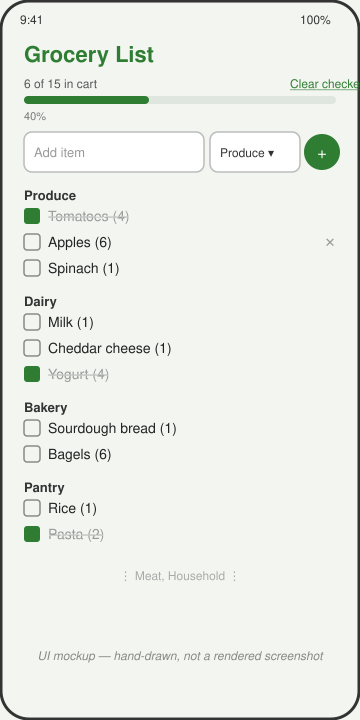

# Grocery List

A Kotlin Multiplatform grocery list: adding items, checking them off, grouping by aisle category, and tracking cart progress all live in a `shared` module, with a Jetpack Compose screen on Android that lists the fixture grouped by category with a progress bar and an add-item row.



*UI mockup — hand-drawn, not a screenshot. This sandbox has no Android emulator, so the app was built and packaged but never launched on a device.*

## How to run

Requires a JDK 17+ and the Android SDK (`ANDROID_HOME` set, platform 35 and build-tools installed).

```bash
cd projects/2026-09-21-kmp-grocery-list
./gradlew :shared:assemble          # builds the shared module's Android target (klib/jar); iOS targets are skipped on Linux
./gradlew :shared:testDebugUnitTest # runs the shared unit tests
./gradlew :androidApp:assembleDebug # builds the runnable Android app
```

The debug APK is written to `androidApp/build/outputs/apk/debug/androidApp-debug.apk`. Install it on a device or emulator with:

```bash
adb install androidApp/build/outputs/apk/debug/androidApp-debug.apk
```

## Stack

- Kotlin Multiplatform: `shared/` module with `commonMain` (`GroceryItem`/`GroceryCategory` models, the pure `List<GroceryItem>.groupedByCategory()` helper, `GroceryRepository`/`GroceryJsonSource` interfaces, `MockGroceryRepository`, `GroceryListModel` state holder), `androidMain`, and `iosMain`
- `expect fun formatProgress(fraction: Double): String` / `actual` per platform — Android formats with `java.text.NumberFormat.getPercentInstance`, iOS with `NSNumberFormatter`'s percent style, so each target renders the same checked-off fraction through its own locale-aware formatter
- `AndroidGroceryJsonSource` (androidMain) and `IosGroceryJsonSource` (iosMain) each read the same `mock/groceries.json` fixture differently — swap either for a networked `GroceryJsonSource` without touching `MockGroceryRepository` or the UI
- kotlinx.serialization for JSON decoding, kotlinx.coroutines `StateFlow` for shared state
- Android app: Jetpack Compose, Material 3 (`ExposedDropdownMenuBox` for the new-item category picker, `Checkbox` + `LinearProgressIndicator` for the list), Gradle Kotlin DSL, Gradle wrapper included (8.9)
- Unit tests (`shared/src/commonTest`) cover `groupedByCategory()` ordering and `MockGroceryRepository`/`GroceryListModel` parsing, toggling, adding, removing, and clearing checked items, run on the JVM via `:shared:testDebugUnitTest`

## Limitations

- **Verified only on the Android target.** `./gradlew :shared:assemble`, `:shared:testDebugUnitTest` (4 tests, all green), and `:androidApp:assembleDebug` all pass on this runner, and the resulting APK was inspected (via `strings` on its dex files) to confirm it contains the shared module's classes and the bundled `assets/mock/groceries.json`. No emulator or device was available, so the app was never actually launched or tapped through.
- **iOS target is source-only.** `iosX64`, `iosArm64`, and `iosSimulatorArm64` are declared in `shared/build.gradle.kts`; the Kotlin/Native compiler disables them on this Linux host ("cannot be built on this machine") and `shared/src/iosMain` (`Platform.ios.kt`, `IosGroceryJsonSource.kt`) has never been compiled. The code is clean and complete, but unverified — building it for real requires Xcode on macOS.
- No persistence: adds, removals, and checked state reset when the process dies, since they only live in the in-memory `GroceryListModel` state.
- No swipe-to-delete or drag-to-reorder — removing an item is a tap on its trailing ✕ button.
