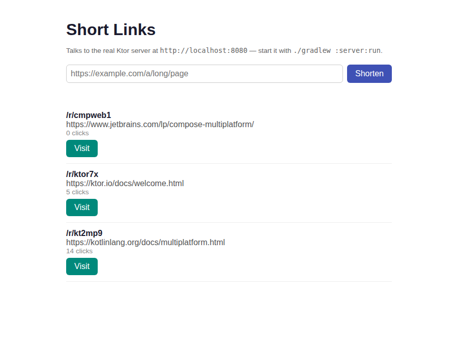

# Short Link Service

A URL shortener: paste a long URL to get a short code back, visiting `/r/<code>` redirects to the original URL and counts the click — with the model, validation, and short-code logic defined once in a Kotlin Multiplatform `shared` module and used by a real Ktor server plus three clients (Android, iOS, web) that all talk to it over HTTP.



*Real screenshot — Chromium headless, loading `webApp`'s production bundle against the actual `server/` process on `localhost:8080`.*

## How to run

Requires a JDK 17+, and Node + Yarn on `PATH` (only used to bundle `webApp`; no Android SDK or Xcode needed for the server/web pieces).

### 1. Start the server

```bash
cd projects/2026-09-22-kmpfullstack-short-link-service
./gradlew :server:run
```

It listens on `http://localhost:8080`, seeded from `mock/links.json`.

### 2. Exercise it

```bash
curl -s http://localhost:8080/links
curl -s -i -X POST http://localhost:8080/links -H 'Content-Type: application/json' \
  -d '{"longUrl":"https://ktor.io/docs/server-testing.html"}'
curl -s -i http://localhost:8080/r/kt2mp9        # 302 redirect, counts a click
curl -s -i http://localhost:8080/r/doesnotexist  # 404
```

### 3. Run the web client against it

```bash
./gradlew :webApp:jsBrowserDistribution
cd webApp/build/dist/js/productionExecutable && python3 -m http.server 8090
```

Open `http://localhost:8090` — it lists the server's links live and lets you shorten a new one or click "Visit" to register a click.

### 4. Build the other targets

```bash
./gradlew :shared:jvmTest :shared:testDebugUnitTest :shared:jsTest   # shared logic, 3 platforms
./gradlew :androidApp:assembleDebug                                  # Android APK
```

`androidApp` points at `http://10.0.2.2:8080` (the emulator's alias for the host), so it needs the server running on the host machine to actually load data once launched — this runner has no emulator, so that part is unverified (see Limitations).

`iosApp/` is a Swift Package; there's no Xcode or Swift toolchain with SwiftUI on this Linux runner, so it wasn't built here. `verify-ios` (below) compiles it for real on macOS.

## Endpoints

- `GET /links` — list all short links, newest first
- `POST /links` — body `{"longUrl": "https://..."}`; `201` with the new link, `400` with `{"message": "..."}` if the URL doesn't start with `http(s)://` and have a real host
- `GET /r/{code}` — `302` redirecting to the long URL and incrementing its click count, `404` if the code doesn't exist

## Real verification performed on this runner

- `./gradlew :shared:jvmTest` (7 tests: short-code generation, URL validation, the three use cases) — **passing**
- `./gradlew :shared:testDebugUnitTest` (same suite on the Android/JVM target) — **passing**
- `./gradlew :shared:jsTest` (same suite compiled to JS, run headlessly via Karma) — **passing**
- `./gradlew :server:test` (4 tests against the real Ktor routes via `testApplication`) — **passing**
- `./gradlew :server:installDist` then running the real server and hitting it with `curl` — the transcript above is real output from that run, not fabricated (`kt2mp9`'s click count visibly goes from 14 → 15)
- `./gradlew :androidApp:assembleDebug` — **builds a real debug APK**; not launched, no emulator on this runner
- `./gradlew :webApp:jsBrowserDistribution` — **builds a real webpack bundle**; served it with `python3 -m http.server` alongside the actual running server and loaded it in headless Chromium — the screenshot above is that real page, showing the three seeded links fetched live over `fetch()`, not mock data baked into the page

## Stack

- **`shared/`** (commonMain, targets: `jvm`, `androidTarget`, `iosX64`/`iosArm64`/`iosSimulatorArm64`, `js(IR)`): `ShortLink`/`CreateLinkRequest`/`ApiError` (`kotlinx.serialization`), `ShortCodeGenerator` (collision-avoiding random codes), `isValidHttpUrl`, the `LinkRepository` interface, and three use cases (`ListLinksUseCase`, `CreateShortLinkUseCase`, `VisitLinkUseCase`) returning a `LinkResult<T>` sealed class instead of throwing. This is the one place the domain is defined — every target below either runs it directly or calls an HTTP API backed by it.
- **`server/`**: Ktor + Netty, `InMemoryLinkRepository` (mutex-guarded, seeded from a bundled copy of `mock/links.json`) implementing `shared`'s `LinkRepository` directly on the JVM — no HTTP hop between the route handlers and the domain logic. CORS is wide open (`anyHost()`) since this is a local dev server every client on this machine talks to.
- **`androidApp/`**: Jetpack Compose + Material 3, a `ShortLinkViewModel` (StateFlow) driving `ListLinksUseCase`/`CreateShortLinkUseCase`/`VisitLinkUseCase` from `shared`, backed by an Android-specific `HttpLinkRepository` (Ktor client, `Android` engine) that implements the same `LinkRepository` interface the server uses on-process.
- **`webApp/`**: Kotlin/JS (IR), no framework — `kotlinx.browser` DOM calls, a JS-engine `HttpLinkRepository` (Ktor client, `Js` engine) implementing the same interface again, driving the same three shared use cases.
- **`iosApp/`**: Swift 6, SwiftUI, `@Observable`, Swift Package Manager. Reimplements the same contract (`ShortLink`, `isValidHttpUrl`, `LinkRepository` protocol, `HttpLinkRepository` over `URLSession`, `ShortLinkModel`) in Swift rather than consuming `shared`'s compiled `.xcframework` — see Limitations for why.

## Limitations

- **iOS does not link the compiled `shared` module.** Kotlin/Native can only cross-compile Apple targets on a macOS host; this runner is Linux, so `shared`'s `iosX64`/`iosArm64`/`iosSimulatorArm64` klibs were never built, and there's no macOS step anywhere in this repo's CI that builds an `.xcframework` for `iosApp` to link. `iosApp/` is therefore a faithful hand-written Swift mirror of the same JSON contract and the same three operations (list/create/visit), not a consumer of the compiled shared code — same feature set, different mechanism, and said so plainly rather than pretending it's wired up.
- **Android was never launched.** `assembleDebug` produces a real, installable APK, but this runner has no emulator or device, so the UI was never tapped through. It points at `10.0.2.2:8080`, the emulator's host alias, matching the pattern any real emulator run would need.
- **The web client needs two terminals** (server + `http.server` serving the bundle) since Kotlin/JS doesn't bundle a backend; that's inherent to it being a static SPA talking to a separate API.
- **In-memory only.** All three — server state, the mock seed, and every client's view of it — reset when the server restarts. No auth, no database, no rate limiting: this is a demo of the wiring, not a production shortener.
- **Short codes aren't guaranteed globally unique across restarts** in the sense that a fresh server re-seeds from the same `mock/links.json`, so `kt2mp9`/`ktor7x`/`cmpweb1` reappear every time — expected for a from-scratch mock seed, not a bug.

- **iOS build: passing.** Compiled on macOS against the iOS 17 simulator SDK by the `verify-ios` job.

- **iOS build: passing.** Compiled on macOS against the iOS 17 simulator SDK by the `verify-ios` job.
