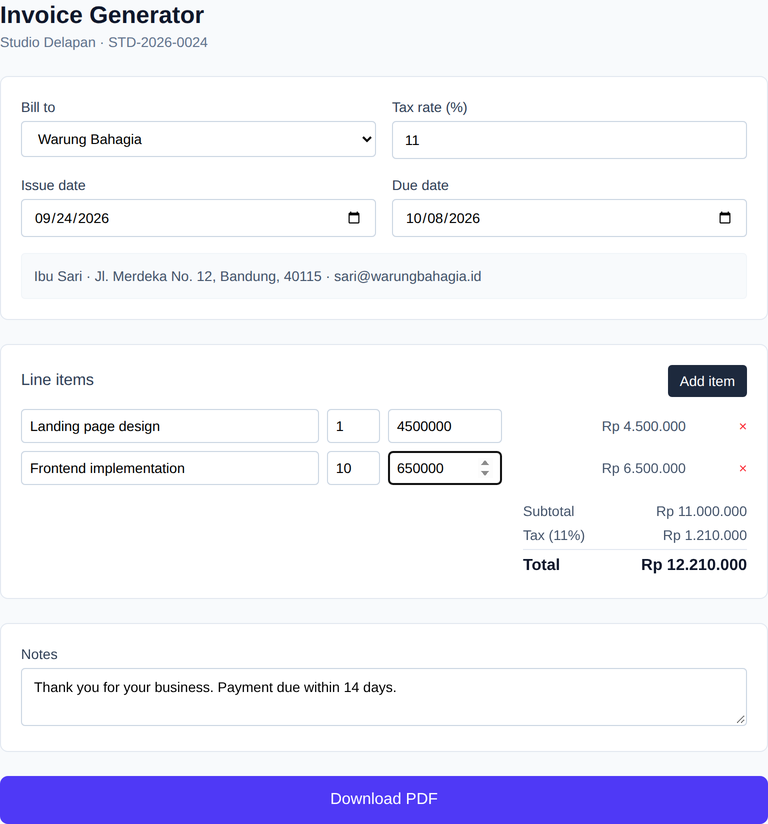

# Invoice Generator

A single-screen React app where a freelancer picks a client, edits line items, and downloads a formatted PDF invoice with tax and totals calculated automatically.



*Real screenshot, captured headlessly with Chromium against a running `vite preview` server.*

## How to run

Requires Node.js 20+.

```bash
cd projects/2026-09-24-freelance-invoice-generator
npm install
npm run dev
```

Open the printed local URL (default `http://localhost:5173`). Pick a client, edit the line items, and click **Download PDF** to generate the invoice client-side. To build and serve the production bundle instead:

```bash
npm run build
npm run preview
```

## Stack

- React 19 + TypeScript, scaffolded with Vite 8
- Tailwind CSS v4 via `@tailwindcss/vite`
- `jspdf` renders the invoice as a real PDF entirely in the browser — no server round trip
- Business profile and client list come from `MockInvoiceDataProvider` (`src/lib/invoiceDataProvider.ts`), which implements an `InvoiceDataProvider` interface and reads `public/mock/*.json` (served copies of `mock/*.json`) over `fetch`. Pointing the app at a real backend later means writing one class that implements the same interface and swapping the export — nothing in `App.tsx` changes.
- `oxlint` for linting (`npm run lint`)

## Limitations

- Business profile and clients are static fixture data (`mock/business.json`, `mock/clients.json`) — there is no API key or network call to a real accounting system.
- The invoice number increments from a fixed `nextInvoiceSequence` in the fixture; nothing persists between page loads, so every session starts from the same number.
- No invoice history, saved drafts, or multi-currency support — amounts are formatted as IDR only.
