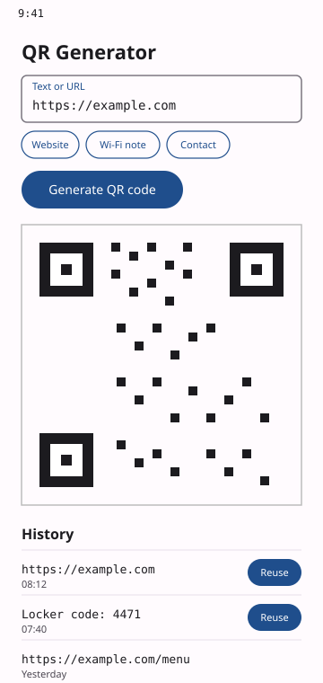

# QR Generator

A single-screen Android app that turns typed text or a URL into a scannable QR code, offers a few starter presets, and keeps a reusable history of recent codes.



*UI mockup — hand-drawn, not a screenshot. This sandbox has no Android emulator, so the app was built and packaged but never launched on a device.*

## How to run

Requires a JDK 17+ and the Android SDK (`ANDROID_HOME` set, platform 35 and build-tools installed).

```bash
cd projects/2026-09-25-android-qr-generator
./gradlew assembleDebug
```

The debug APK is written to `app/build/outputs/apk/debug/app-debug.apk`. Install it on a device or emulator with:

```bash
adb install app/build/outputs/apk/debug/app-debug.apk
```

## Stack

- Kotlin, Jetpack Compose, Material 3
- `ViewModel` + `StateFlow` for generator state
- [ZXing](https://github.com/zxing/zxing) `core` for QR encoding (pure Java, no camera/scanning code — this app only writes codes, offline, from typed text)
- Gradle Kotlin DSL, Gradle wrapper included (8.9)
- Starter presets and initial history read from `mock/qr_history.json` (bundled as an Android asset) through a `QrHistoryRepository` interface — swap `LocalQrHistoryRepository` for a networked/synced implementation later without touching the ViewModel or UI

## Limitations

- No emulator or physical device was available in this environment, so the app was never actually launched or tapped through. What *was* verified: `./gradlew assembleDebug` runs clean on this repo's Android SDK (compile, resource merge, dex, package all succeed), and the packaged APK contains `assets/mock/qr_history.json` (checked with `unzip -l`).
- `preview.svg` is a hand-drawn mockup of the intended layout, not a real screenshot.
- No persistence: closing the app resets history to the fixture's starting entries. Codes generated during a session are prepended with a fresh ID and the current device time, capped at 8 entries, but nothing is written back to disk.
- Encoding is entirely on-device (ZXing's `QRCodeWriter`); there is no scanning/decoding feature and no network call of any kind.
