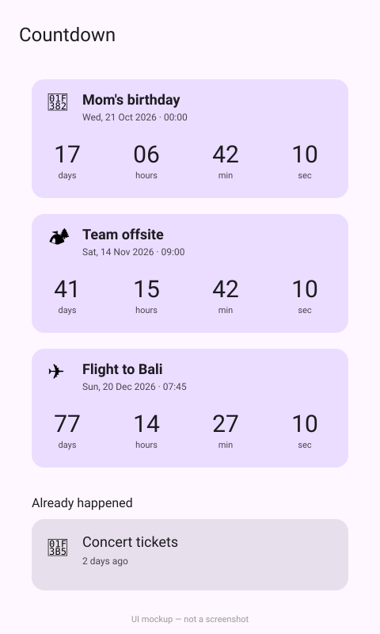

# Countdown

An Android app that shows live days/hours/minutes/seconds countdowns to your upcoming events, with past events listed below.



*UI mockup, hand-drawn as SVG — not a screenshot.*

## How to run

Needs JDK 17 and the Android SDK (`ANDROID_HOME` set).

```bash
cd projects/2026-10-03-android-countdown   # or the repo root if published standalone
./gradlew assembleDebug
./gradlew installDebug   # with a device or emulator connected
```

The APK lands in `app/build/outputs/apk/debug/`.

## Stack

Kotlin, Jetpack Compose, Material 3, ViewModel + StateFlow, Gradle KTS.
Events come from `mock/events.json` (copied into `app/src/main/assets/mock/`) through the
`EventRepository` interface; replace `LocalEventRepository.kt` to use a real backend.

## Limitations

- `./gradlew assembleDebug` passed on Linux (JDK 17, compileSdk 35); the app was **never launched** — there is no emulator, so the UI has not been seen running and the preview is a mockup.
- Events are read-only; there is no way to add or edit them in the app.
- Countdowns use the device's local time zone and the mock dates are fixed, so some of them will eventually be in the past.
