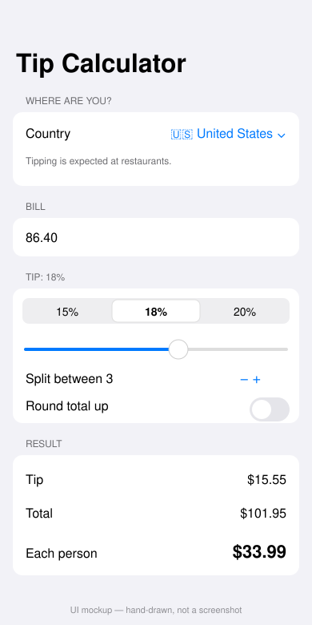

# Tip Calculator

A single-screen SwiftUI app that suggests a tip for the country you are eating in, then splits the total between diners down to the cent.



*Hand-drawn UI mockup, not a screenshot — see Limitations.*

## How to run

Requires Swift 6+. The calculation logic and fixture loading (`TipCore`) build and test on Linux or macOS. The UI needs Xcode on macOS.

```bash
cd projects/2026-10-04-ios-tip-calculator
swift test    # on macOS; on Linux see the note below
```

To see the screen: open `Package.swift` in Xcode, add an iOS App target that depends on the `TipCalculator` library, and make its entry point `TipCalculatorApp` (or show `TipCalculatorView()` in your own `WindowGroup`). Run it in the simulator.

On Linux, `swift test` fails to build the `TipCalculator` UI target (`no such module 'SwiftUI'`). To run only the logic tests there, build a copy of the package without that target.

## Stack

- Swift 6, SwiftUI, `@Observable` model (`TipCalculatorModel`), Swift Package Manager, no dependencies
- `TipCore`: Foundation-only module with the tip maths (integer cents, half-up rounding, shares that differ by at most one cent) and input parsing
- Tipping customs for six countries read from `mock/tipping.json` (copied into `Sources/TipCore/Resources/` as a package resource) through the `TippingRepository` protocol — a real client replaces `MockTippingRepository` in one file
- Tests in `Tests/TipCoreTests` use the `Testing` framework

## Limitations

- **The SwiftUI screen was written but not built or run.** This runner is Linux with no Xcode or simulator. `preview.svg` is a hand-drawn UI mockup. The `verify-ios` job on macOS is the first real compile of the UI.
- **Verified here:** `TipCore` built and all 6 unit tests passed on Linux (Swift 6.x), using a copy of the package without the UI target.
- Tipping guidance is illustrative fixture data, not authoritative advice.
- One currency per country, no exchange rates, no saved history.

- **iOS build: passing.** Compiled on macOS against the iOS 17 simulator SDK by the `verify-ios` job.

- **iOS build: passing.** Compiled on macOS against the iOS 17 simulator SDK by the `verify-ios` job.
