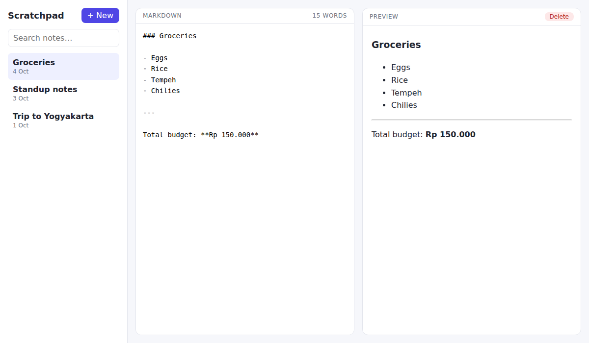

# Markdown Scratchpad

A two-pane notes app: write Markdown on the left, see it rendered live on the right, with search and autosave.



## How to run

```bash
npm install
npm run dev        # http://localhost:5173
npm test           # unit tests for the Markdown renderer
npm run build      # production bundle in dist/
```

Requires Node 20+.

## Stack

- Vue 3 (Composition API, `<script setup>`) + Pinia
- Vite
- A small hand-written Markdown renderer in `src/lib/markdown.js` (headings, bold/italic, inline code, fenced code, lists, quotes, rules, `http(s)` links). Raw HTML is escaped, so notes cannot inject markup.
- Notes load from `mock/notes.json` through `src/services/noteSource.js`; edits persist to `localStorage`. Replace that one file to talk to a real API.

## Verification

Built, tested (6 passing `node --test` cases), served with `vite preview`, and screenshotted in headless Chromium. The screenshot above is real.

## Limitations

- Markdown subset only: no tables, images, nested lists or reference links.
- Notes live in one browser's `localStorage`; there is no sync.
- Delete has no undo.
