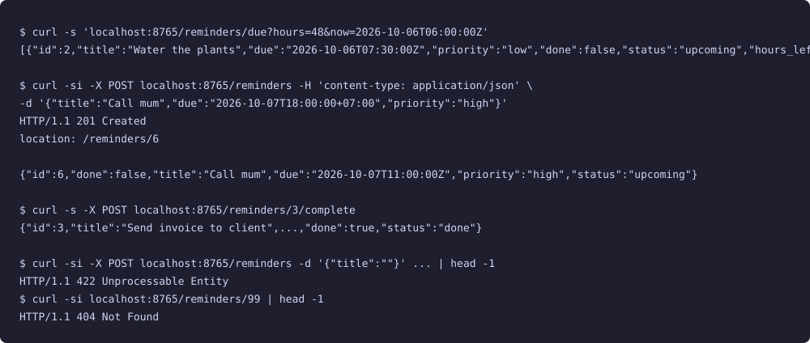
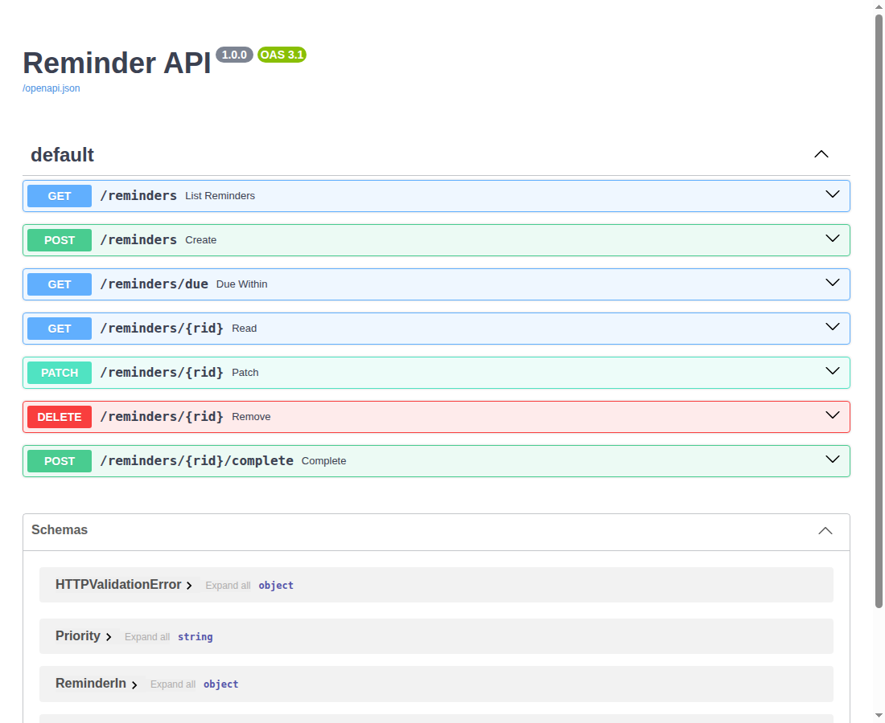

# Reminder API

A small FastAPI service for creating reminders, listing them by status (upcoming / overdue / done), and asking what is due in the next N hours.



The auto-generated docs page, captured from the running server with headless Chromium:



## How to run

```bash
python3 -m venv .venv
.venv/bin/pip install -r requirements.txt
.venv/bin/python smoke_test.py          # exercises every endpoint in-process
.venv/bin/uvicorn main:app --port 8000  # then open http://localhost:8000/docs
```

Try it:

```bash
curl -s 'localhost:8000/reminders?status=overdue'
curl -s 'localhost:8000/reminders/due?hours=48'
curl -si -X POST localhost:8000/reminders -H 'content-type: application/json' \
  -d '{"title":"Call mum","due":"2026-10-07T18:00:00+07:00","priority":"high"}'
curl -s -X POST localhost:8000/reminders/3/complete
```

## Endpoints

| Method | Path | Notes |
|---|---|---|
| GET | `/reminders` | optional `status=upcoming\|overdue\|done`, optional `now` override |
| GET | `/reminders/due` | open reminders due within `hours` (1–720, default 24) |
| POST | `/reminders` | 201 + `Location`; title 1–120 chars; due is normalised to UTC |
| GET / PATCH / DELETE | `/reminders/{id}` | 404 when missing, 204 on delete |
| POST | `/reminders/{id}/complete` | marks done |

The optional `now` query parameter lets you test the overdue logic against a fixed clock.

## Stack

Python 3.12, FastAPI, Pydantic, Uvicorn. Storage sits behind the `ReminderStore` protocol in `store.py`; the bundled `JsonSeedStore` loads `mock/reminders.json`, and a database-backed class can replace it in that one file.

## Limitations

- Data is in memory and resets on restart; changes are never written back to the JSON seed.
- No authentication, no notifications — it only stores and reports reminders.
- Not safe for multiple worker processes (each would hold its own copy of the data).
