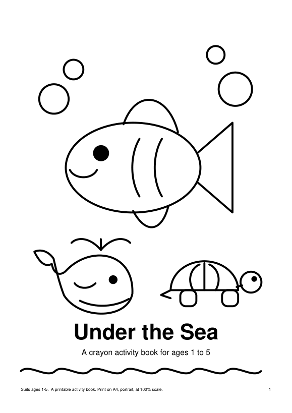
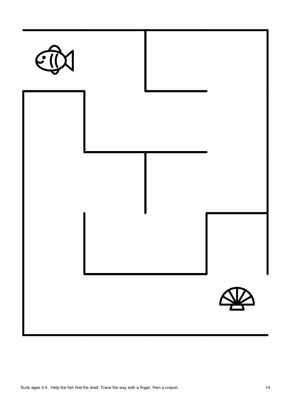
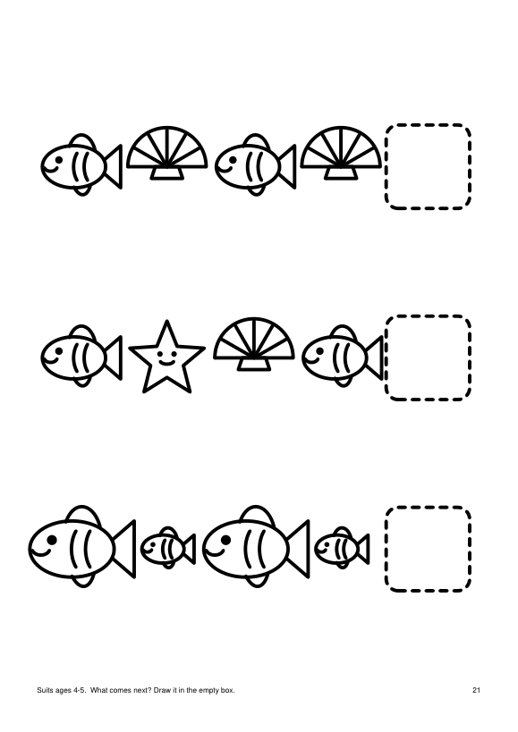
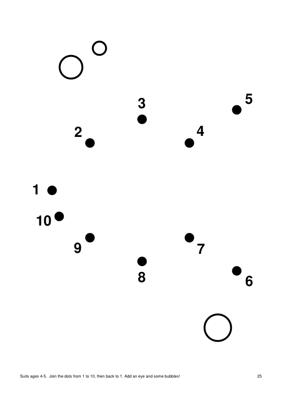

# Under the Sea: printable activity book (ages 1–5)

A 27-page, ink-friendly A4 activity book of tracing, colouring, counting, mazes, matching and dot-to-dot pages, drawn entirely by `generate.py`.

   

## How to run

The finished book is already in this folder: print `book.pdf` on A4, portrait, at 100% scale.

To regenerate it from a clean checkout (needs Python 3):

```bash
cd projects/2026-10-07-kidsbook-under-the-sea
python3 -m venv .venv && . .venv/bin/activate
pip install reportlab pymupdf
python3 generate.py                 # writes book.pdf (27 pages)
python3 render_previews.py 1 14 21 25   # optional: writes preview/page-NN.png
```

Rerunning `generate.py` gives a byte-identical `book.pdf` (fixed random seed and invariant PDF mode).

## What's inside

Pages run roughly easiest to hardest, and each carries a small "Suits ages X–Y" note for the parent at the foot.

| Pages | Content | Ages |
|---|---|---|
| 1 | Cover | all |
| 2–3 | Trace straight lines across and down | 1–2 |
| 4–5 | Colour a big fish and a whale | 1–3 |
| 6, 23 | Size: circle the big one / circle the smallest | 2–5 |
| 7, 19 | Trace waves; zigzags and loops | 2–5 |
| 8, 10, 13, 17, 22 | Colour a starfish, crab, octopus, turtle, sailing boat | 2–5 |
| 9, 16, 24 | Counting 1–3, 5 and 8, with outlined numerals | 2–5 |
| 11–12 | Trace shapes; colour the circles | 3–4 |
| 14, 26 | Mazes with wide corridors (easy, longer) | 3–5 |
| 15 | Matching pairs | 3–4 |
| 18 | Odd one out | 3–5 |
| 20, 25 | Dot-to-dot 1–5 and 1–10 | 3–5 |
| 21 | Pattern completion | 4–5 |
| 27 | "Well done" certificate | all |

Design rules followed: black line art on white with no colour fills, strokes of at least 4pt, 15mm safe margin, no reading needed (the only text is for the parent), and only generic sea creatures, with no licensed characters.

## Stack

Python 3, [ReportLab](https://pypi.org/project/reportlab/) for vector PDF output, and PyMuPDF only to render the preview PNGs.

## Limitations

- Verified by generating the PDF, confirming it has 27 pages, and looking at rendered images of every page. It has not been printed on a real home printer.
- Previews are rendered with PyMuPDF because this runner has no poppler (`pdftoppm`/`pdfinfo`). The PDF is plain vector output, so `pdftoppm` works too.
- The creatures are simple geometric drawings, so the whale's tail in particular is stylised.
- Maze difficulty is set by grid size, not tuned with children.
