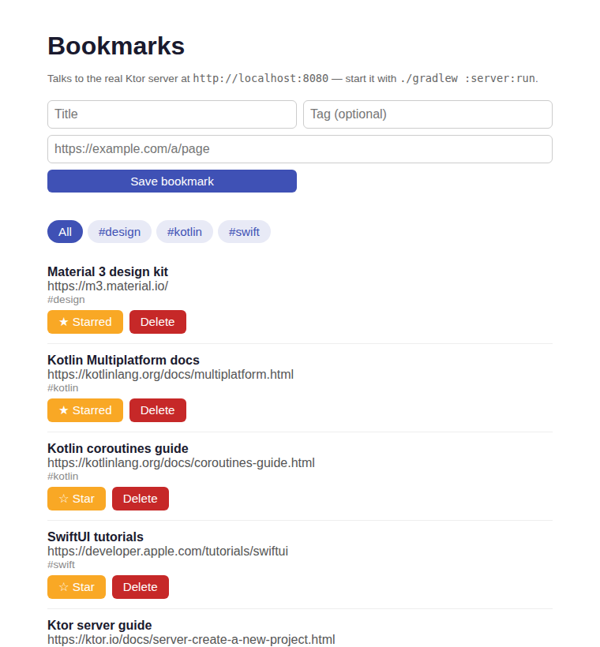

# Bookmark Store

A tagged bookmark manager with starring and deletion: one Kotlin domain in `shared/`, a Ktor API in `server/`, and Android, web and iOS clients that all talk to it.



*Real headless-Chromium screenshot of `webApp/` served next to the running `server/` — the list is fetched over `fetch()` from the API, starred bookmarks first.*

## How to run

Needs JDK 17 (and Node for the web bundle; the Android SDK only for `androidApp`). From a clean checkout of this folder:

```bash
# 1. Start the API on http://localhost:8080 (seeded from mock/bookmarks.json)
./gradlew :server:run
```

```bash
# 2. In a second terminal: build and serve the web client, then open http://localhost:8000
./gradlew :webApp:jsBrowserDistribution
cd webApp/build/dist/js/productionExecutable && python3 -m http.server 8000
```

```bash
# Tests and full build (shared on JVM/Android/JS, server, Android debug APK, web)
./gradlew build :shared:jsTest
```

```bash
# Android (emulator reaches the host server at 10.0.2.2:8080)
./gradlew :androidApp:assembleDebug
```

```bash
# iOS (macOS with Xcode only) — open iosApp/Package.swift in Xcode, or:
cd iosApp && swift test
```

### API

| Method & path | Result |
|---|---|
| `GET /bookmarks?tag=kotlin` | `200`, starred first then newest; `tag` optional |
| `POST /bookmarks` `{"title","url","tag"}` | `201` with the new bookmark; `400` `{"message"}` for blank/over-80-char title, non-http(s) URL or malformed JSON |
| `POST /bookmarks/{id}/star` | `200` with the toggled bookmark; `404` unknown id; `400` non-numeric id |
| `DELETE /bookmarks/{id}` | `204`; `404` unknown id |

Real output from the running server (`./gradlew :server:installDist`, then `curl`):

```text
$ curl -X POST localhost:8080/bookmarks -H 'Content-Type: application/json' -d '{"title":"Gradle docs","url":"https://docs.gradle.org","tag":"Build Tools"}'
HTTP/1.1 201 Created
{ "id": 6, "title": "Gradle docs", "url": "https://docs.gradle.org", "tag": "build-tools", "starred": false, "createdAtEpochSeconds": 1791421362 }

$ curl -X POST localhost:8080/bookmarks -H 'Content-Type: application/json' -d '{"title":"Bad","url":"gradle.org"}'
HTTP/1.1 400 Bad Request
{ "message": "Enter a full http:// or https:// URL" }

$ curl -X POST localhost:8080/bookmarks/2/star      -> 200, "starred": true
$ curl -X POST localhost:8080/bookmarks/99/star     -> 404, "No bookmark with id 99"
$ curl -X DELETE localhost:8080/bookmarks/3         -> 204 No Content
$ curl -X DELETE localhost:8080/bookmarks/3         -> 404, "No bookmark with id 3"
```

## Stack

- **`shared/`** (`commonMain`; targets `jvm`, Android, `iosX64`/`iosArm64`/`iosSimulatorArm64`, `js(IR)`): `Bookmark`, `BookmarkRepository`, validation/tag normalisation and four use cases (`List`, `Add`, `ToggleStar`, `Remove`) returning a `BookmarkResult` sealed class. Unit-tested in `commonTest`.
- **`server/`**: Ktor + Netty, in-memory repository (mutex-guarded) seeded from `mock/bookmarks.json`, which is bundled as a classpath resource. It calls the same shared use cases the clients do.
- **`androidApp/`**: Jetpack Compose + Material 3, `ViewModel` + `StateFlow`, Ktor client behind `HttpBookmarkRepository` — swap that one file for another backend.
- **`webApp/`**: Kotlin/JS, plain DOM, Ktor JS client behind `HttpBookmarkRepository`, driving the shared use cases.
- **`iosApp/`**: Swift 6, SwiftUI, `@Observable`, SwiftPM, `URLSession` behind `HttpBookmarkRepository`.

## Verified on this runner

- `./gradlew build :shared:jsTest` — **passes**: shared tests on JVM, Android and JS (Karma), 4 Ktor `testApplication` server tests, Android debug build and lint, web bundle.
- Server started and exercised with `curl` (output above); web client screenshot taken against the live server.

## Limitations

- **The iOS app was not built or run at authoring time** (Linux runner, no Xcode). The `verify-ios` job compiles it on macOS afterwards. It also does **not** link the compiled `shared` module: Kotlin/Native can only produce Apple targets on macOS and nothing here builds an `.xcframework`, so `iosApp/` is a hand-written Swift mirror of the same JSON contract and use-case rules.
- **The Android app was built (`assembleDebug`, lint) but never launched** — no emulator here.
- Persistence is in-memory: restarting the server resets to the seed file. No auth, no pagination.
- The web client needs the two terminals above; the API allows any origin (CORS `anyHost`), which is fine for local dev only.

- **iOS build: passing.** Compiled on macOS against the iOS 17 simulator SDK by the `verify-ios` job.
