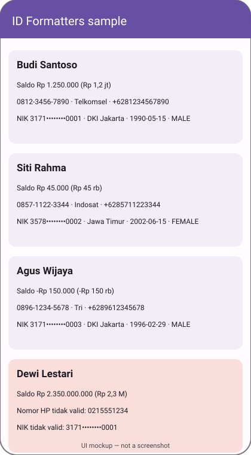

# idformat — Indonesian formatters for Android

A dependency-free Kotlin library that formats and parses Rupiah, normalises Indonesian mobile numbers, and structurally validates NIK (national ID) numbers.



*UI mockup, hand-drawn SVG — not a screenshot. The sample app was compiled but never run on a device.*

## How to run

Requires JDK 17 and the Android SDK (`ANDROID_HOME` set, or `sdk.dir` in `local.properties`).

```bash
./gradlew :idformat:testDebugUnitTest   # 10 unit tests, JVM only
./gradlew build assembleDebug           # library + sample app APK
./gradlew :idformat:publishToMavenLocal # install the library locally
```

The APK lands in `sample/build/outputs/apk/debug/sample-debug.apk`.

## Using it

```kotlin
// settings: mavenLocal() after publishToMavenLocal
implementation("com.dailyprojects.idformat:idformat:1.0.0")
```

```kotlin
Rupiah.format(1_250_000)            // "Rp 1.250.000"
Rupiah.formatCompact(1_500_000)     // "Rp 1,5 jt"
Rupiah.parse("Rp 1.250.000,00")     // 1250000L, or null if malformed

PhoneNumber.parse("+62 812-3456-7890")?.national  // "081234567890"
PhoneNumber.parse("081234567890")?.display        // "0812-3456-7890"
PhoneNumber.parse("081234567890")?.operator       // "Telkomsel"

Nik.parse("3171011505900001")   // NikInfo(province DKI Jakarta, born 1990-05-15, MALE, …)
Nik.mask("3171011505900001")    // "3171••••••••0001"
```

The sample (`sample/`) renders `mock/customers.json` through a `CustomerRepository` interface; replace `AssetCustomerRepository` to load real data.

## Stack

Kotlin 2.0, Android Gradle Plugin 8.6, minSdk 24 (library) / 26 (sample), JUnit 4. The library has no runtime dependencies and avoids `java.time` so it works on API 24.

## Limitations

- Verified here: `./gradlew build` passes and all 10 unit tests pass. The sample app was **compiled but not run** — this runner has no emulator.
- NIK validation is structural only (length, province code, calendar date, non-zero sequence). It cannot tell whether a number was actually issued, and regency/district codes are not checked against a registry.
- Operator prefixes cover common mobile ranges and drift as numbers are ported between carriers; treat `operator` as a hint.
- Rupiah values are whole `Long` amounts; fractional sen are rejected by `parse`.
- Not published to Maven Central; `publishToMavenLocal` only.
