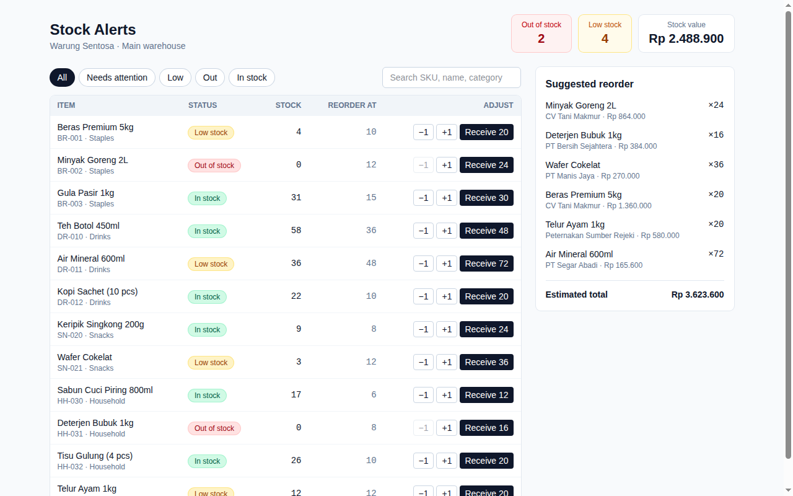

# Stock Alerts

A Vue 3 stock screen for a small shop: it flags low and out-of-stock items, lets staff sell, add or receive stock, and builds a suggested supplier reorder list with an estimated cost.



*Real headless-Chromium screenshot of the built app (also at `preview.png`).*

## How to run

```bash
cd projects/2026-10-10-freelance-stock-alerts   # or the repo root if published standalone
npm install
npm run build        # type-checks with vue-tsc, then builds
npm run dev          # http://127.0.0.1:5173
```

To serve the production build instead: `npm run preview` (http://127.0.0.1:4173).

## How it works

- Status is derived from stock vs. reorder level: `0` = out, `<= reorderLevel` = low, otherwise in stock.
- The reorder suggestion orders whole supplier batches (`reorderQty`) until stock would clear the reorder level.
- All reads and writes go through the `InventoryRepository` interface in `src/data/repository.ts`. The mock implementation loads `mock/inventory.json`; replacing the exported `inventory` with an HTTP client is the only change needed for a real backend.

## Stack

Vue 3 (`<script setup>`, Composition API) · TypeScript · Vite 7 · Tailwind CSS v4 · vue-tsc.

## Verified

`npm run build` passes. The built app was served and driven with headless Chromium (puppeteer-core): receiving stock for an out-of-stock item moved the counters from 2 out / 4 low to 1 out / 4 low, the "Needs attention" tab showed 5 rows, and searching "wafer" narrowed to one row.

## Limitations

- Stock changes live in memory only and reset on reload.
- No authentication, multi-warehouse support, or purchase-order export.
- No automated test suite; verification was the manual browser run above.
