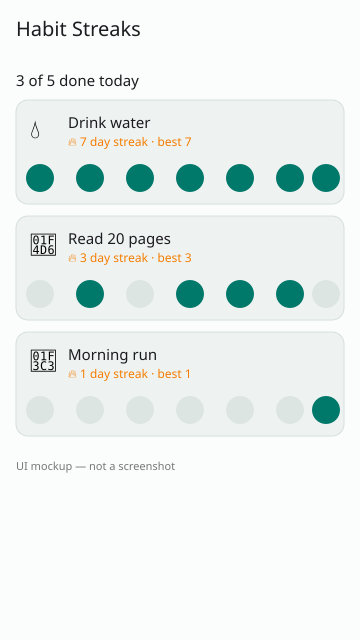

# Habit Streaks

An Android app that lists your daily habits with current and best streaks, a seven-day dot strip per habit, and a one-tap check-in for today.



*UI mockup, hand-drawn as SVG — not a screenshot.*

## How to run

Needs JDK 17 and the Android SDK (`ANDROID_HOME` set).

```bash
./gradlew assembleDebug
./gradlew installDebug   # with a device or emulator attached
```

The debug APK lands in `app/build/outputs/apk/debug/`. Tap today's dot (rightmost) on a card to check a habit in or out.

## Stack

Kotlin, Jetpack Compose, Material 3, ViewModel + StateFlow, Gradle KTS. Habit history is read from `mock/habits.json` (copied to `app/src/main/assets/mock/`) through the `HabitRepository` interface; history is stored as "days ago" offsets so the data is always relative to today. A real client replaces `LocalHabitRepository.kt` only.

## Limitations

- Check-ins live in memory only and reset when the process restarts.
- Only today can be toggled; past days are read-only.
- No emulator on the authoring runner, so the UI has not been seen running; the preview is a mockup.
